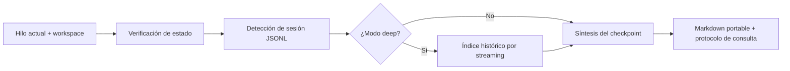

# Portable Context Checkpoint

Skill para crear un handoff operativo y portable de una conversación de Codex. Su objetivo es que un hilo nuevo pueda continuar el trabajo sin depender de que el contexto anterior siga cargado en la ventana activa.

La salida no es un resumen narrativo. Es un checkpoint accionable con el objetivo actual, estado verificado, decisiones, contexto operativo, archivos relevantes, siguientes pasos y una ruta segura para consultar el historial original cuando haga falta.

## Para qué sirve

Úsala cuando necesites:

- continuar un trabajo en un hilo nuevo;
- pausar una investigación o implementación y retomarla después;
- entregar contexto a otra persona o agente;
- conservar decisiones y estado operativo de uno o varios repositorios;
- consultar selectivamente una conversación extensa sin cargar el JSONL completo;
- generar un índice histórico de un hilo muy largo.

No está pensada para:

- reemplazar documentación permanente del proyecto;
- copiar una conversación completa;
- guardar secretos o credenciales;
- convertir automáticamente el historial en una base vectorial;
- garantizar que la sesión detectada sea la correcta sin verificación.

## Resultado esperado

La skill genera un bloque `# CONTEXTO PORTABLE` y, cuando existe un proyecto activo claro, también escribe un archivo como:

```text
portable-context-checkpoint-YYYY-MM-DD-HH-mm-ss.md
```

El checkpoint separa hechos verificados de inferencias e incluye un protocolo de recuperación histórica. Cuando se identifica una sesión local, el JSONL absoluto se conserva como fuente histórica de verdad; el checkpoint y el índice profundo funcionan como mapas para consultarlo de manera focalizada.

## Modos

| Modo | Cuándo usarlo | Comportamiento |
| --- | --- | --- |
| `complete` | Uso normal; es el modo predeterminado | Conserva el estado operativo necesario para continuar sin extenderse de más. |
| `compact` | Cuando se pide algo breve o fácil de pegar | Mantiene las secciones esenciales y comprime detalles secundarios. |
| `deep` | Cuando se pide todo el hilo, continuidad histórica completa o el historial es demasiado largo | Recorre el JSONL por streaming, genera un índice y sintetiza los principales frentes de trabajo. |

El modo `deep` es opcional y no forma parte del flujo normal. Es una herramienta de recuperación para hilos grandes, no un índice semántico ni una transcripción.

## Requisitos

- Codex CLI, la extensión de Codex para IDE o la aplicación de escritorio con soporte para skills.
- Python 3.10 o posterior para ejecutar los helpers incluidos.
- Acceso local a `~/.codex/sessions` si se quiere recuperar la sesión fuente.
- Git cuando el checkpoint necesite verificar rama, estado o diffs de un repositorio.

Los scripts usan únicamente la biblioteca estándar de Python.

## Instalación

### Con el instalador de skills

En Codex, invoca `$skill-installer` y pídele instalar este repositorio:

```text
$skill-installer instala https://github.com/arturhc/portable-context-checkpoint
```

### Instalación manual para el usuario

La ubicación personal documentada actualmente por Codex es `$HOME/.agents/skills`. En PowerShell:

```powershell
$skillsRoot = Join-Path $HOME ".agents\skills"
New-Item -ItemType Directory -Force -Path $skillsRoot
git clone https://github.com/arturhc/portable-context-checkpoint (Join-Path $skillsRoot "portable-context-checkpoint")
```

En Bash:

```bash
mkdir -p "$HOME/.agents/skills"
git clone https://github.com/arturhc/portable-context-checkpoint \
  "$HOME/.agents/skills/portable-context-checkpoint"
```

Codex detecta normalmente las skills nuevas y sus modificaciones sin configuración adicional. Si no aparece, reinicia Codex. Usa `/skills` o escribe `$` en Codex CLI o la extensión de IDE para confirmar que `portable-context-checkpoint` esté disponible.

También puede instalarse dentro de un repositorio bajo `.agents/skills/portable-context-checkpoint` cuando solo deba estar disponible para ese proyecto.

Referencia: [documentación oficial para crear y cargar skills en Codex](https://developers.openai.com/codex/build-skills).

## Cómo usarla

### Invocación explícita

Menciona la skill directamente:

```text
$portable-context-checkpoint crea un checkpoint para continuar este trabajo en otro hilo
```

Ejemplos por modo:

```text
$portable-context-checkpoint genera un checkpoint completo
$portable-context-checkpoint hazlo compacto para pegarlo en otro hilo
$portable-context-checkpoint crea un checkpoint deep con la historia completa
```

También puedes pedir que destaque un cambio reciente:

```text
$portable-context-checkpoint actualiza el checkpoint e incluye qué cambió desde el anterior
```

### Invocación implícita

Codex puede seleccionarla automáticamente cuando el pedido coincide con su descripción. Por ejemplo:

```text
Hazme un handoff para retomar esto mañana.
Prepara el contexto para seguir en un hilo nuevo.
Necesito un snapshot operativo del estado actual.
```

### Continuar desde un checkpoint

En el hilo nuevo, adjunta o pega el checkpoint y pide continuar. El prompt recomendado dentro del propio archivo indica que el siguiente agente debe:

1. leer el checkpoint completo;
2. revisar `git status`;
3. preservar cambios existentes;
4. consultar primero el deep index, si existe;
5. buscar el JSONL solo con términos focalizados;
6. volver a verificar cualquier dato mutable antes de actuar.

El usuario puede activar la recuperación histórica con frases como:

```text
Busca en nuestro hilo previo lo de X.
Revisa qué decidimos sobre Y.
Ubica el contexto de Z.
```

## Cómo funciona



El flujo está dividido en dos capas:

- **Instrucciones:** `SKILL.md` define cuándo activar la skill, qué verificar, cómo redactar, la estructura de salida y las reglas de seguridad.
- **Helpers deterministas:** los scripts localizan la sesión más probable y construyen un índice acotado cuando se necesita revisar un historial extenso.

Esta separación permite que el razonamiento y la síntesis sigan a cargo de Codex, mientras que las operaciones repetibles sobre archivos grandes se ejecutan de forma predecible.

## Scripts incluidos

### `codex_session_probe.py`

Busca sesiones `*.jsonl` bajo `~/.codex/sessions`, ordena candidatos recientes y estima cuál corresponde al trabajo activo.

La selección considera:

- fecha de modificación;
- presencia del directorio de trabajo en una ventana reciente del JSONL;
- existencia de registros legibles;
- mensajes y herramientas detectados al final de la sesión.

Por defecto solo lee una ventana final acotada; no carga el archivo completo.

Uso básico:

```powershell
python scripts/codex_session_probe.py --format markdown
```

Indicando el proyecto activo:

```powershell
python scripts/codex_session_probe.py --cwd "C:/workspace/project" --format markdown
```

Salida estructurada:

```powershell
python scripts/codex_session_probe.py --format json
```

Opciones principales:

| Opción | Función |
| --- | --- |
| `--sessions-dir` | Cambia el directorio donde se buscan sesiones. |
| `--session-path` | Analiza una sesión concreta. |
| `--cwd` | Ayuda a puntuar candidatos según el proyecto activo. |
| `--limit` | Limita el número de candidatos recientes. |
| `--tail-bytes` | Controla cuántos bytes finales se inspeccionan. |
| `--format` | Produce `json` o `markdown`. |

La sesión elegida siempre debe tratarse como probable hasta confirmar que corresponde al hilo correcto.

### `codex_deep_index.py`

Construye un índice histórico a partir de una sesión JSONL. Recorre el archivo completo línea por línea, sin cargarlo entero en memoria.

Extrae:

- conteos por rol y herramienta;
- categorías generales de trabajo;
- muestras acotadas por tema;
- hitos detectados mediante heurísticas;
- eventos recientes;
- términos recomendados para búsquedas focalizadas.

Uso básico:

```powershell
python scripts/codex_deep_index.py --session-path "C:/Users/example/.codex/sessions/YYYY/MM/DD/rollout-...jsonl" --format markdown
```

Escribiendo el resultado en el proyecto:

```powershell
python scripts/codex_deep_index.py --session-path "C:/Users/example/.codex/sessions/YYYY/MM/DD/rollout-...jsonl" --format markdown --output "C:/workspace/project/codex-deep-index-YYYY-MM-DD-HH-mm-ss.md"
```

Opciones principales:

| Opción | Función |
| --- | --- |
| `--session-path` | Usa un JSONL concreto. |
| `--sessions-dir` | Busca la sesión más reciente en otro directorio. |
| `--format` | Produce `markdown` o `json`. |
| `--output` | Escribe el índice en un archivo. |
| `--max-events-per-topic` | Acota las muestras conservadas por categoría. |
| `--max-timeline` | Limita los hitos incluidos en la salida. |
| `--recent-limit` | Limita el buffer de eventos recientes. |

El índice es léxico y heurístico. No utiliza embeddings y no sustituye el JSONL cuando se necesita recuperar un detalle histórico exacto.

## Seguridad y privacidad

Los JSONL de Codex pueden contener prompts, rutas locales, salidas de herramientas, datos personales y secretos que aparecieron durante el trabajo.

La skill aplica estas reglas:

- nunca copiar ni adjuntar el JSONL completo al checkpoint;
- usar rutas absolutas solo como referencias locales;
- consultar con `Select-String`, `rg`, tails acotados o rangos pequeños;
- redactar secretos y datos personales antes de reutilizar fragmentos;
- mencionar la ubicación o función de una credencial, no su valor;
- volver a verificar hechos mutables en el workspace o servicio real.

El indexador incluye redacción básica para algunos patrones comunes, pero no es un detector exhaustivo de secretos. La revisión final del agente sigue siendo obligatoria.

## Diseño e implementación

La skill sigue un enfoque *instruction-first*:

1. `SKILL.md` conserva el contrato operativo y las decisiones que cambian el comportamiento del agente.
2. `references/examples.md` contiene formas de salida genéricas para evitar contaminar checkpoints reales con nombres o conclusiones de otros proyectos.
3. `codex_session_probe.py` resuelve de manera determinista la búsqueda y puntuación de sesiones.
4. `codex_deep_index.py` resuelve el procesamiento repetible de archivos grandes.
5. `agents/openai.yaml` aporta nombre, descripción y prompt predeterminado para la interfaz.

Decisiones de diseño relevantes:

- **Streaming:** el modo deep procesa el JSONL línea por línea para mantener memoria acotada.
- **Recuperación escalonada:** checkpoint → deep index → búsqueda focalizada en JSONL → verificación en vivo.
- **Generalidad:** las categorías del índice describen áreas técnicas generales y no proyectos concretos.
- **Portabilidad:** los helpers no requieren dependencias externas.
- **Separación de certeza:** la salida distingue hechos verificados de inferencias.
- **Fuente inmutable:** el JSONL se consulta, pero la skill no lo modifica.

## Estructura del repositorio

```text
portable-context-checkpoint/
├── SKILL.md
├── README.md
├── agents/
│   └── openai.yaml
├── references/
│   └── examples.md
└── scripts/
    ├── codex_session_probe.py
    └── codex_deep_index.py
```

## Desarrollo y validación

Comprobar sintaxis y ayuda de los scripts:

```powershell
python -m py_compile scripts/codex_session_probe.py scripts/codex_deep_index.py
python scripts/codex_session_probe.py --help
python scripts/codex_deep_index.py --help
```

Si la skill de sistema `skill-creator` está disponible, valida la estructura con su helper:

```powershell
python "<ruta-a-skill-creator>/scripts/quick_validate.py" .
```

Antes de publicar cambios:

1. confirma que `SKILL.md` sigue teniendo `name` y `description` válidos;
2. ejecuta los helpers o sus smoke tests;
3. revisa que los ejemplos no contengan nombres, rutas o decisiones de proyectos reales;
4. ejecuta `git diff --check`;
5. verifica que no se hayan añadido JSONL, checkpoints generados, secretos o `__pycache__`.

## Limitaciones conocidas

- La detección de sesión es probabilística y puede elegir el hilo equivocado cuando varias sesiones están activas.
- El índice deep clasifica por palabras y heurísticas; no comprende equivalencias semánticas complejas.
- La redacción automática es una defensa parcial, no una garantía de ausencia de secretos.
- El formato interno de los JSONL pertenece a Codex y puede cambiar; los extractores deben validarse después de cambios importantes del producto.
- Los comandos de recuperación incluidos en los checkpoints están orientados principalmente a PowerShell; pueden adaptarse a `rg`, `grep` o herramientas equivalentes.

## Archivos generados

Los siguientes archivos son artefactos de uso y normalmente no deben versionarse en este repositorio:

```text
portable-context-checkpoint-*.md
codex-deep-index-*.md
```

Revísalos antes de compartirlos: aunque la skill intenta redactar información sensible, el contenido final depende del historial procesado.
